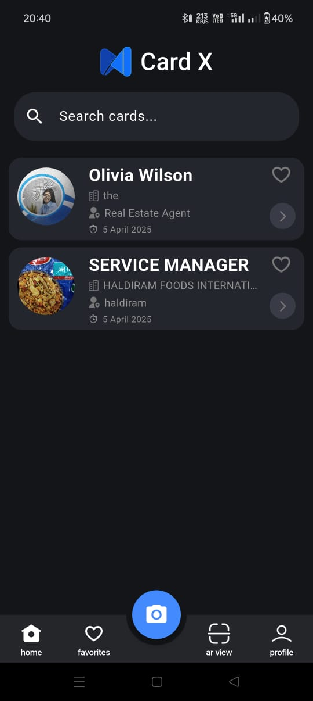

# 💼 CardX – Smarter Business Cards, Powered by AI + AR

CardX is a next-gen digital business card manager built with **Flutter**, **Machine Learning**, and **Augmented Reality**. Ditch paper cards — scan, organize, and create premium AR business cards that can be tracked and viewed in the real world.

---

## ✨ Features

- 📷 **Scan Physical Cards** using ML Kit’s OCR
- 🧠 **AI Field Detection** (Name, Email, Role, etc.)
- 🔐 **Securely Store & Manage Contacts**
- ⭐ **Favorite, Search & Note-taking Support**
- 🌍 **Create Premium AR Cards** viewable via camera
- 🔄 **Upcoming CRM Integrations** (HubSpot, Zoho, Salesforce)

---

<table>
  <tr>
    <th>Auth</th>
    <th>Scan & Extract</th>
    <th>Organized Cards</th>
    <th>AR View</th>
  </tr>
  <tr>
    <td></td>
    <td></td>
    <td></td>
    <td></td>
  </tr>
</table>

## ⚙️ Tech Stack

- **Flutter** – Cross-platform App
- **Google ML Kit** – Text Recognition (OCR)
- **Unity + Vuforia** – AR Premium Card Viewer
- **Appwrite** – Auth, Database, and Cloud Functions
- **GitHub** – Team Collaboration & CI/CD
- **Platform Channels** – flutter-unity-widget

---

## 📦 Installation

```bash
# Clone the repository
git clone https://github.com/your-username/cardx.git
cd cardx

# Get packages
flutter pub get

🔐 API Keys Setup
Before running the app, create the following files in your project:

lib/constants/appwrite_constants.dart

class AppwriteConstants {
  static const String projectId = 'your_appwrite_project_id';
  static const String endPoint = 'https://your-appwrite-endpoint.com';
  static const String databaseId = 'your_database_id';
  static const String usersCollectionId = 'your_users_collection_id';
  static const String cardCollectionId = 'your_card_collection_id';
}


lib/constants/gemini_constants.dart
class GeminiConstants {
  static const String apiKey = 'your_gemini_api_key';
  static const String model = 'gemini-pro'; // or other model name
}

# Run the app
flutter run


🤝 Contributing
We welcome contributions! Whether it’s fixing bugs, enhancing features, or improving documentation — your support matters.

Getting Started
Fork the repo

Create a new branch: git checkout -b your-feature

Make your changes and commit: git commit -m "Add your feature"

Push to your fork: git push origin your-feature

Open a Pull Request 🚀


```
